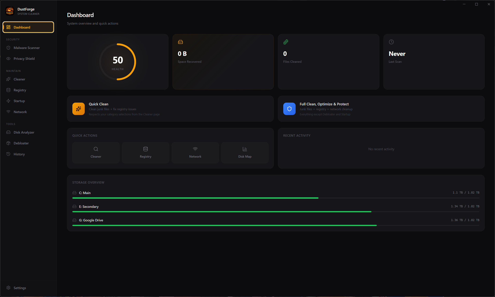

# DustForge

<p align="center">
  
</p>

<p align="center">
  A modern, open-source system cleaner for Windows.
</p>

<p align="center">
  <a href="https://github.com/dbfx/dustforge/releases"></a>
  <a href="LICENSE"></a>
  <a href="https://github.com/dbfx/dustforge/actions"></a>
</p>

---

<p align="center">
  
</p>

## Features

### Cleaning & Optimization
- **System Cleaner** — Remove temp files, logs, caches, and other system junk
- **Browser Cleaner** — Clear browser caches, cookies, and history across all major browsers
- **App Cleaner** — Clean up leftover data from installed applications
- **Gaming Cleaner** — Free space from game launchers and cached game data
- **Recycle Bin** — Scan and empty the recycle bin
- **Registry Cleaner** — Detect and fix broken or orphaned registry entries, scheduled tasks, and security issues
- **Startup Manager** — Control which programs launch at startup with boot impact analysis
- **Network Cleanup** — Clean DNS cache, Wi-Fi profiles, ARP cache, and network history
- **Disk Analyzer** — Interactive treemap visualization of disk usage across all drives
- **Debloater** — Remove pre-installed Windows bloatware by category
- **Driver Manager** — Scan and remove stale driver packages, check for driver updates via Windows Update
- **Uninstall Leftovers** — Detect and clean orphaned files from uninstalled programs

### Security & Privacy
- **Malware Scanner** — Multi-engine threat detection with signature matching, heuristic analysis, and Windows Defender integration
- **Privacy Shield** — Control 30+ Windows privacy settings including telemetry, advertising ID, Cortana, and tracking

### Monitoring & Tools
- **Performance Monitor** — Real-time CPU, memory, disk, and network monitoring with per-core stats and process manager
- **System Restore Points** — Create Windows restore points before cleaning operations
- **Secure Delete** — Overwrite files with random data before deletion for sensitive data
- **Cleaning History** — Track past cleaning sessions and space recovered
- **Scheduled Scans** — Set up automatic scans on a daily, weekly, or monthly schedule
- **One-Click Clean** — Scan and clean junk files, registry, network, and stale drivers with a single click
- **CLI Mode** — Run scans from the command line without the GUI for scripting and automation

## CLI Mode

DustForge can run entirely from the command line — no GUI window is opened. This is useful for scripting, IT admin workflows, and scheduled tasks beyond the built-in scheduler.

### Usage

```
dustforge --cli [options] [categories...]
```

### Categories

| Flag | Description |
|------|-------------|
| `--system` | System temp files, caches, logs, crash dumps |
| `--browser` | Browser caches (Chrome, Edge, Brave, Firefox, etc.) |
| `--app` | Application caches (Discord, VS Code, npm, etc.) |
| `--gaming` | Game launcher caches, GPU shader caches, redistributables |
| `--recycle-bin` | Windows Recycle Bin |
| `--all` | All categories (default when none specified) |

### Options

| Flag | Description |
|------|-------------|
| `--clean` | Delete found items after scanning (without this flag, scan-only) |
| `--json` | Output results as JSON instead of human-readable text |
| `-h`, `--help` | Show help message |
| `-v`, `--version` | Show version |

### Examples

```bash
# Scan everything (dry run — nothing is deleted)
dustforge --cli

# Scan and clean system junk only
dustforge --cli --system --clean

# Scan system and browser caches
dustforge --cli --system --browser

# Scan everything and clean, output as JSON (for scripting)
dustforge --cli --all --clean --json

# Use in a scheduled task (Task Scheduler, cron, etc.)
dustforge --cli --all --clean
```

### JSON Output

When `--json` is passed, output is a single JSON object:

```json
{
  "scan": {
    "categories": ["system", "browser"],
    "results": [
      {
        "category": "system",
        "subcategory": "User Temp Files",
        "itemCount": 42,
        "totalSize": 104857600,
        "items": [{ "path": "...", "size": 1024, "lastModified": 1700000000000 }]
      }
    ],
    "totalItems": 42,
    "totalSize": 104857600
  },
  "clean": {
    "totalCleaned": 104857600,
    "filesDeleted": 40,
    "filesSkipped": 2,
    "errors": []
  }
}
```

The `clean` key is only present when `--clean` is used.

### Exit Codes

| Code | Meaning |
|------|---------|
| `0` | Success |
| `1` | Errors occurred during scan or clean |

## Download

Get the latest installer from the [Releases](https://github.com/dbfx/dustforge/releases) page.

## Disclaimer

DustForge is intended for **advanced users** who understand system maintenance and the implications of removing files, registry entries, and other system data. By using this software, you acknowledge that:

- **You are solely responsible** for reviewing all items before removal. Always inspect scan results carefully before cleaning.
- **We accept no responsibility or liability** for any data loss, system instability, or other damage resulting from the use of this software.
- **Create backups** before performing any cleaning operations, especially registry cleaning and debloating.
- This software is provided **"as is"**, without warranty of any kind, express or implied.

Use at your own risk.

## License

[MIT](LICENSE)
